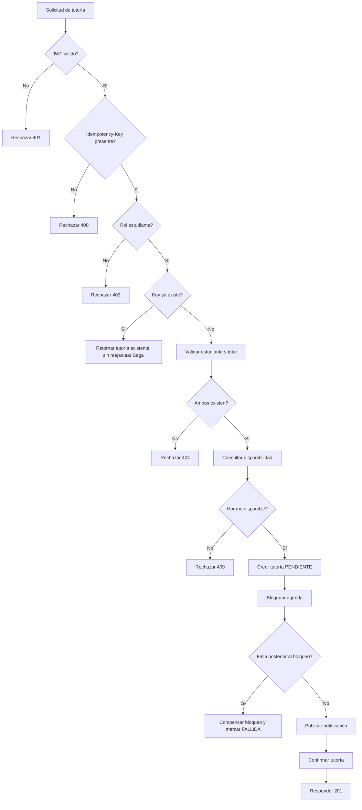

# Proceso BPM de solicitud de tutoría

Este documento describe la solicitud de tutoría como flujo académico-operativo y como orquestación técnica entre servicios. La intención es que un revisor pueda entender qué ocurre, quién participa, qué evidencia existe y qué brechas siguen abiertas sin reconstruir el proceso desde el código.

## Ruta rápida de revisión

1. Iniciar el flujo con una solicitud autenticada a `POST /v1/tutorias`.
2. Validar que el JWT identifica a un estudiante y que el servicio no confía en el `idEstudiante` enviado por el cuerpo.
3. Confirmar que `ms-tutorias` valida estudiante/tutor, consulta agenda, crea una tutoría pendiente, bloquea agenda, publica notificación y confirma la tutoría.
4. Revisar que cada paso usa `X-Correlation-ID` para tracking y evidencia operativa.
5. Para falla posterior al bloqueo, verificar que se ejecuta compensación de agenda y la tutoría queda marcada como fallida.

## Alcance

Incluye el flujo actual para crear una tutoría desde `ms-tutorias` con validación de identidad, usuarios, agenda, persistencia, RabbitMQ y tracking.

No incluye reglas académicas avanzadas, políticas de cupos, reintentos productivos, conciliación manual, calendario institucional ni nombres de cursos o evaluaciones.

## Vista BPM del proceso

## Orquestación técnica actual

`ms-tutorias` actúa como orquestador. No existe un motor BPM externo; el proceso está implementado como una Saga orquestada en código mediante llamadas HTTP, persistencia local, RabbitMQ y eventos de tracking.

| Paso | Responsable/componente | Entrada | Salida | Errores principales | Evidencia actual |
| --- | --- | --- | --- | --- | --- |
| 1. Solicitud de tutoría | Cliente consumidor y `ms-tutorias` | `POST /v1/tutorias`, body de solicitud, `Authorization: Bearer <token>`, `Idempotency-Key` obligatorio, `X-Correlation-ID` opcional | Request recibida y correlation ID disponible | Body incompleto o dependencias posteriores fallidas; `400` si falta `Idempotency-Key` | `ms-tutorias/src/api/routes/tutorias.routes.js`, `ms-tutorias/src/api/controllers/tutorias.controller.js`, OpenAPI en `ms-tutorias/docs/swagger.yaml` |
| 2. Autenticación JWT | `jwt.middleware.js` en `ms-tutorias` | Header `Authorization` | `req.user` con `sub`, `name`, `role`, `iss` | `401` si falta token, formato inválido, firma inválida o token expirado | `ms-tutorias/src/api/middlewares/jwt.middleware.js`; token emitido por `ms-auth/src/domain/services/auth.service.js` |
| 3. Autorización e integridad de identidad | Controlador de tutorías | `req.user.role`, `req.user.sub`, body original | Payload confiable con `idEstudiante` tomado del JWT | `403` si el rol no es estudiante | `ms-tutorias/src/api/controllers/tutorias.controller.js` |
| 3b. Deduplicación por Idempotency-Key | `ms-tutorias` (servicio) | `idempotencyKey` | Si ya existe una tutoría con esa clave, se retorna sin tocar usuarios/agenda/notificación | Ninguno (siempre corta antes de la Saga si la key ya existe) | `ms-tutorias/src/domain/services/tutoria.service.js`, `ms-tutorias/src/infrastructure/repositories/tutoria.repository.js` |
| 4. Validación de estudiante y tutor | `ms-tutorias` + `ms-usuarios` | `idEstudiante`, `idTutor`, `X-Correlation-ID` | Estudiante y tutor encontrados | `404` si no existen; `503` si `ms-usuarios` falla rápido por timeout/red/Circuit Breaker | `ms-tutorias/src/domain/services/tutoria.service.js`, `ms-tutorias/src/infrastructure/clients/usuarios.client.js` |
| 5. Consulta de disponibilidad | `ms-tutorias` + `ms-agenda` | `idTutor`, `fechaSolicitada` | `disponible: true/false` | Error HTTP de agenda; posible `409` si no hay disponibilidad | `ms-tutorias/src/infrastructure/clients/agenda.client.js`, `ms-agenda/src/domain/services/agenda.service.js` |
| 6. Creación de tutoría pendiente | `ms-tutorias` y su repositorio | Datos validados de solicitud | Tutoría persistida en estado `PENDIENTE` | Error de persistencia local | `ms-tutorias/src/domain/services/tutoria.service.js`, `ms-tutorias/src/infrastructure/repositories/tutoria.repository.js` |
| 7. Bloqueo de agenda | `ms-tutorias` + `ms-agenda` | `idTutor`, `fechaInicio`, `duracionMinutos`, `idEstudiante` | `idBloqueo` creado | `400` si faltan datos; `409` si el horario ya no está disponible; error de persistencia de agenda | `ms-agenda/src/domain/services/agenda.service.js`, `ms-agenda/src/infrastructure/repositories/agenda.repository.js` |
| 8. Confirmación de tutoría y encolado de notificación (outbox) | `ms-tutorias` | Payload de notificación con destinatario, asunto, cuerpo y `correlationId` | Tutoría `CONFIRMADA` y fila `PENDIENTE` en `tutorias_notificaciones_outbox`, confirmadas en una sola transacción | Si el `UPDATE` a `CONFIRMADA` falla (p.ej. transición inválida), no se inserta la fila de outbox | `ms-tutorias/src/infrastructure/repositories/tutoria.repository.js`, `ms-tutorias/src/infrastructure/repositories/outbox.repository.js`; contratos en [`docs/event-contracts.md`](./event-contracts.md) |
| 8b. Publicación de notificación | `ms-tutorias` (poller de outbox) + RabbitMQ | Filas `PENDIENTE` de `tutorias_notificaciones_outbox` | Mensaje en `notificaciones_email_queue`; fila marcada `PUBLICADO` | Si `publishToQueue` falla, se reintenta en el siguiente ciclo del poller hasta `OUTBOX_MAX_INTENTOS`, luego pasa a `FALLIDO` | `ms-tutorias/src/infrastructure/messaging/outbox.publisher.js`; contratos en [`docs/event-contracts.md`](./event-contracts.md) |
| 9. Procesamiento de notificación | `ms-notificaciones` | Mensaje de `notificaciones_email_queue` | Email simulado procesado y `ack` | Payload inválido o error de procesamiento termina con `nack(false, false)` hacia DLQ | `ms-notificaciones/src/app.js`, `ms-notificaciones/src/domain/services/notificacion.service.js`, [`docs/event-contracts.md`](./event-contracts.md) |
| 10. Confirmación de tutoría | `ms-tutorias` y repositorio | `idTutoria`, estado `CONFIRMADA` | Respuesta `201 Created` con tutoría confirmada | Error de persistencia; activa compensación si ya existía bloqueo | `ms-tutorias/src/domain/services/tutoria.service.js` |
| 11. Tracking y observabilidad | Productores de eventos y dashboard | Eventos con `service`, `message`, `cid`, `timestamp`, `status` | Eventos visibles por `tracking_events_exchange` y Socket.IO | Estructura parcial sin schema formal ni publisher confirms | `tracking-dashboard/src/server.js`, productores RabbitMQ, [`docs/event-contracts.md`](./event-contracts.md) |
| 12. Compensación ante falla posterior al bloqueo | `ms-tutorias` + `ms-agenda` | `idBloqueo`, `idTutoria`, error capturado | Bloqueo eliminado y tutoría marcada como `FALLIDA` | Si los reintentos síncronos de compensación se agotan, el detalle se registra en `compensaciones_pendientes` (misma transacción que el `UPDATE` a `FALLIDA`) para que un worker en segundo plano reintente `cancelarBloqueo` | `ms-tutorias/src/domain/services/tutoria.service.js`, `ms-tutorias/src/infrastructure/workers/compensacion.worker.js`, `ms-agenda/src/domain/services/agenda.service.js`, [`docs/event-contracts.md`](./event-contracts.md) |

## Estados del proceso

| Estado | Significado operativo | Estado de implementación | Evidencia |
| --- | --- | --- | --- |
| Solicitud recibida | El cliente inicia el trámite de tutoría mediante endpoint protegido. | Implementado | Ruta `POST /v1/tutorias` con middleware JWT. |
| Autenticada | El token se validó y el payload queda disponible para autorización. | Implementado/parcial | Validación local con secreto compartido; no se documenta rotación de claves ni introspección. |
| Autorizada | Solo un usuario con rol de estudiante puede solicitar tutoría. | Implementado | El controlador rechaza otros roles con `403`. |
| Identidad normalizada | El identificador del estudiante se toma del JWT, no del body. | Implementado | `idEstudiante: req.user.sub` en controlador. |
| Participantes validados | Estudiante y tutor existen en el servicio de usuarios. | Implementado/parcial | Consulta a `ms-usuarios`; Circuit Breaker cubre degradación, pero no hay contrato formal de usuario compartido. |
| Agenda disponible | El horario solicitado no se solapa con bloqueos existentes. | Implementado/parcial | Consulta y revalidación en `ms-agenda`; la garantía depende de la persistencia y de pruebas de concurrencia suficientes. |
| Tutoría pendiente | Se registra una tutoría antes de completar la Saga. | Implementado | Estado `PENDIENTE` en `ms-tutorias`; es el único estado inicial válido, forzado por `tutoria.repository.js`. |
| Agenda bloqueada | Se crea un bloqueo asociado al tutor, estudiante y horario. | Implementado | `crearBloqueo` en `ms-agenda`. |
| Notificación encolada (outbox) | La intención de notificar se persiste atómicamente junto con la confirmación de la tutoría. | Implementado | Fila `PENDIENTE` en `tutorias_notificaciones_outbox`, misma transacción que el `UPDATE` a `CONFIRMADA`. |
| Notificación publicada | Un poller publica la fila de outbox en la cola de notificaciones. | Implementado/parcial | Cola durable y DLQ documentadas; el poller reintenta hasta `OUTBOX_MAX_INTENTOS`; falta schema formal de eventos. |
| Tutoría confirmada | La Saga completa el flujo feliz. | Implementado | Estado `CONFIRMADA` después de publicar notificación; la transición `PENDIENTE -> CONFIRMADA` está validada por una máquina de estados explícita en el repositorio (ver `ms-tutorias/src/domain/models/tutoria-estado.js`). |
| Tutoría fallida | Una falla posterior a la persistencia se refleja en estado de error. | Implementado/parcial | Estado `FALLIDA`; la transición `PENDIENTE -> FALLIDA` también está validada por la máquina de estados; falta proceso operativo de conciliación manual. |
| Bloqueo compensado | Si la Saga falla después del bloqueo, se elimina el bloqueo de agenda. | Implementado | Compensación por HTTP con reintentos síncronos acotados; si se agotan, la fila `PENDIENTE` en `compensaciones_pendientes` (misma transacción que `UPDATE` a `FALLIDA`) es reclamada por un worker en segundo plano que reintenta hasta `COMPENSACION_PENDIENTE_MAX_INTENTOS`. |
| Observado | El proceso puede seguirse por correlation ID en logs y dashboard. | Parcial | Eventos de tracking existentes; sin schema formal ni garantías de entrega. |

## Compensación ante falla posterior al bloqueo

La compensación se activa cuando existe `idBloqueo` y ocurre un error antes de completar la tutoría. El comportamiento actual es:

1. `ms-tutorias` captura el error y publica tracking de falla.
2. Si hay `idBloqueo`, llama a `DELETE /bloqueos/{idBloqueo}` en `ms-agenda`, con hasta 3 intentos (configurable
   por `COMPENSACION_AGENDA_MAX_INTENTOS`) y backoff corto entre intentos.
3. Si algún intento se completa, registra tracking de compensación exitosa.
4. Si todos los intentos síncronos fallan, incrementa la métrica `compensacion_fallida_total{etapa="sincrona"}`
   (ver [`docs/observability-runbook.md`](./observability-runbook.md)) y registra el detalle del bloqueo no
   compensado en la tabla `compensaciones_pendientes` para reintento en segundo plano — no queda solo en el log.
5. Si ya existe una tutoría persistida, intenta actualizarla a estado `FALLIDA` con el error asociado; el
   registro de compensación pendiente del paso 4 se inserta en la **misma transacción** que este `UPDATE` (ver
   [`docs/event-contracts.md`](./event-contracts.md)) — si el `UPDATE` no afecta ninguna fila, tampoco se
   inserta el registro huérfano.
6. Un worker en segundo plano (`compensacion.worker.js`) reclama las filas `PENDIENTE` de
   `compensaciones_pendientes` y reintenta `cancelarBloqueo` hasta `COMPENSACION_PENDIENTE_MAX_INTENTOS`; si se
   resuelve, marca `RESUELTO`; si agota los reintentos, marca `FALLIDO` e incrementa
   `compensacion_fallida_total{etapa="worker"}` (requiere intervención manual).
7. Relanza un error controlado para mantener el contrato público de respuesta.

Para validación controlada existe una falla demo posterior al bloqueo, desactivada por defecto y habilitada únicamente si se cumplen ambas condiciones: `ENABLE_DEMO_FAULT_INJECTION=true` y header `X-Demo-Fail-After-Bloqueo: true`. La evidencia académica de PC03 se consolida en [`docs/pc03.md`](./pc03.md); los detalles del proceso permanecen en este documento y los contratos de eventos en [`docs/event-contracts.md`](./event-contracts.md).

## Observabilidad y evidencia

| Evidencia | Uso | Estado |
| --- | --- | --- |
| `X-Correlation-ID` | Agrupar logs y eventos de la misma solicitud. | Implementado/parcial: se propaga entre servicios principales y eventos, pero no hay trazas distribuidas formales. |
| Tracking RabbitMQ | Visualizar eventos por servicio en el dashboard. | Parcial: útil para demo y diagnóstico básico; sin schema/versionado formal. |
| Logs de servicios | Confirmar validación, bloqueo, publicación, error y compensación. | Implementado/parcial: dependen de logs de aplicación, no de una política centralizada. |
| Persistencia de agenda | Verificar que no queden bloqueos duplicados o huérfanos. | Implementado/parcial: existe consulta operativa, pero no auditoría automática. |
| DLQ de notificaciones | Aislar mensajes inválidos de notificación. | Implementado/parcial: DLQ existe, falta procedimiento de replay o descarte controlado. |

La evidencia académica de PC03 se consolida en [`docs/pc03.md`](./pc03.md). Los contratos de eventos y colas están resumidos en [`docs/event-contracts.md`](./event-contracts.md), y el diagnóstico operativo en [`docs/observability-runbook.md`](./observability-runbook.md).

## Riesgos y pendientes

- **Parcial:** no hay motor BPM externo ni definición BPMN ejecutable; el proceso vive en código y documentación.
- **Parcial:** los eventos de tracking y notificación no tienen schema formal ni versionado.
- **Resuelto:** la notificación de tutoría confirmada ya no depende de que el canal RabbitMQ esté disponible en el instante exacto de la confirmación; el patrón outbox (`tutorias_notificaciones_outbox` + `outbox.publisher.js`) persiste la intención de notificar de forma atómica con el cambio de estado y reintenta la publicación en segundo plano. Sigue sin usarse publisher confirms de RabbitMQ propiamente dichos (la garantía viene de la tabla outbox, no del broker).
- **Resuelto:** si falla la compensación de agenda tras agotar los reintentos síncronos, el detalle se registra en la tabla `compensaciones_pendientes` (misma transacción que el `UPDATE` a `FALLIDA`) y un worker en segundo plano (`compensacion.worker.js`) reintenta activamente hasta `COMPENSACION_PENDIENTE_MAX_INTENTOS` — ya no depende de una cola sin consumidor. Una métrica (`compensacion_fallida_total`) y una regla de alerta en Prometheus dan visibilidad si ni el worker logra resolverlo.
- **Resuelto:** las transiciones de estado de la tutoría (`PENDIENTE -> CONFIRMADA`, `PENDIENTE -> FALLIDA`) ya no dependen solo de la disciplina del llamador; `tutoria.repository.js` las valida de forma atómica contra el estado actual antes de aplicar el `UPDATE` (ver `ms-tutorias/src/domain/models/tutoria-estado.js`).
- **Riesgo (parcial):** la consistencia concurrente depende de validaciones y persistencia de agenda. Ya existe
  un test (`ms-tutorias/test/tutoria-concurrencia-agenda.test.js`) que dispara dos Sagas realmente concurrentes
  para el mismo tutor/horario y confirma que una gana y la otra queda `FALLIDA` sin bloqueo huérfano — sigue
  faltando evidencia operativa (no solo de test) contra un entorno real con Postgres/RabbitMQ levantados.
- **Pendiente:** documentar un runbook de conciliación para bloqueos huérfanos, tutorías fallidas y mensajes en DLQ.
- **Pendiente:** formalizar contratos de eventos con AsyncAPI o JSON Schema mínimo.
- **Brecha de producto (S11):** el estado `CANCELADA` existe en el `CHECK` de la tabla `tutorias` y en el enum de
  `tutoria-estado.js`, pero no tiene ningún origen válido declarado (`TRANSICIONES_VALIDAS`) ni ningún caller en
  todo el repositorio. Es una decisión deliberada de alcance, no un descuido de código — pero, en términos de
  producto, hoy **no existe ninguna forma de cancelar una tutoría ya `CONFIRMADA`**, ni para el estudiante, ni
  para el tutor, ni por un camino administrativo. Se deja constancia explícita aquí para que quien decida el
  alcance del proyecto lo sepa, en vez de que quede solo como un comentario de código.

## Próximo paso recomendado

Usar este flujo como mapa de revisión durante la demo operativa: ejecutar una solicitud exitosa, una solicitud con conflicto de agenda y una falla posterior al bloqueo con compensación controlada. Capturar evidencia por `X-Correlation-ID`, estado de agenda, estado de tutoría, eventos de tracking y colas RabbitMQ.
