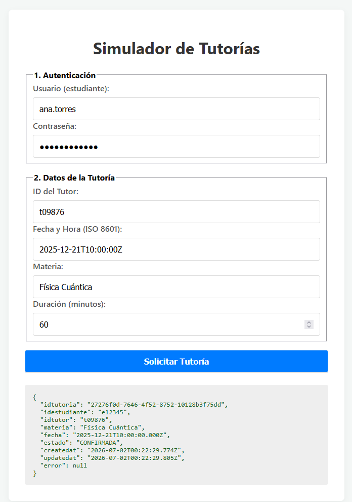
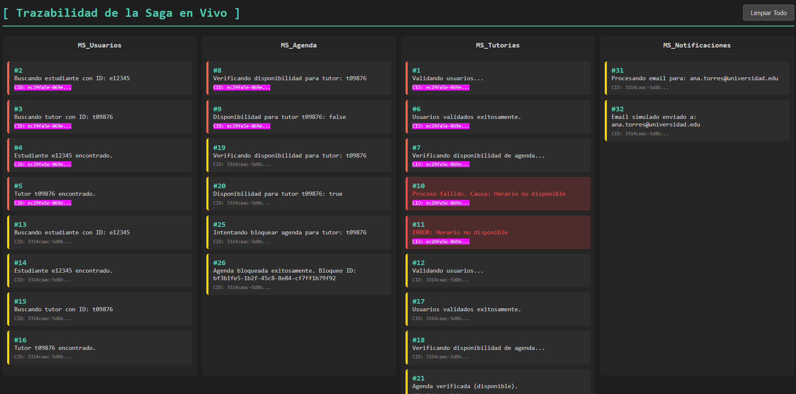
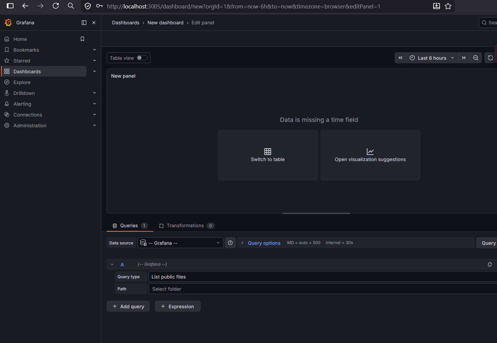

Isabel Pasco

## Contexto
El sistema de Tutorías Universitarias necesita incorporar un flujo de pagos integrado con proveedores externos (Visa, Mastercard) a través de un nuevo servicio `ms-pagos`. El flujo actual valida usuarios, bloquea agenda, registra la tutoría y notifica. Las restricciones principales radican en la naturaleza inestable de los proveedores de pago: pueden ser lentos, enviar callbacks tardíos, duplicar respuestas o fallar. La tutoría solo debe confirmarse si existe una intención de pago exitosa y trazable.

## Problema
El diseño propuesto presenta un anti patron por que aplica acoplamiento temporal mediante transacciones de base de datos largas por medio de llamadas síncronas.

Al abrir una transacción en `ms-tutorias` y esperar sincrónicamente a `ms-pagos` y al proveedor externo, los recursos de la base de datos (hilos, conexiones, bloqueos) quedan rehenes de la latencia de la red. Si el proveedor tarda 30 segundos o hace timeout, la base de datos colapsará por agotamiento del Connection Pool. Peor aún, un timeout HTTP no indica si el pago realmente falló o si se cobró pero la respuesta no llegó, dejando el sistema en un estado ambiguo y vulnerable a dobles cobros si el usuario reintenta.

## Riesgos
- **Fallas y estados ambiguos:** Ante un timeout, `ms-tutorias` hace rollback, pero el cobro pudo haberse efectuado en Visa. 
- **Doble cobro (Negocio):** Si el cliente refresca la pantalla o reintenta por el timeout, se generará un nuevo request que podría cobrarle dos veces.
- **Agotamiento de recursos (Operación):** Las transacciones largas provocan encolamiento y denegación de servicio (DoS) interna, afectando todas las demás operaciones de `ms-tutorias`.
- **Fuga de datos (Seguridad):** Al procesar un flujo lineal sin segregación clara, existe riesgo de que `ms-tutorias` manipule o registre datos sensibles de tarjetas (PCI-DSS) que solo deberían competer al proveedor.

## Diseño propuesto
Se propone una **Saga Orquestada de forma asíncrona** para separar responsabilidades y tolerar latencias.

1. **ms-tutorias (Orquestador):** Recibe la solicitud, valida, bloquea la agenda (`ms-agenda`), y guarda la tutoría en estado `PENDING_PAYMENT` en una transacción local corta.
2. Mediante el patrón *Transactional Outbox*, `ms-tutorias` emite un evento `PaymentRequested` si es que existe el evento y la reserva esta en el estado entonces se procede a enviar mediante RabbitMQ el estado a ms-pagos.
3. **ms-pagos:** Consume el evento, inicia la intención de pago con el proveedor externo y devuelve un token/URL de pago al cliente (si aplica), o espera la resolución.
4. **Proveedor Externo:** Procesa y envía un *Webhook* asíncrono a `ms-pagos`.Así no dependemos de la respuesta del proveedor externo y mantenemos la confiabilidad de los datos.
5. `ms-pagos` valida la firma del webhook y publica el evento `PaymentConfirmed` (o `PaymentFailed`).
6. `ms-tutorias` consume la respuesta asíncrona, actualiza la tutoría a `CONFIRMED` y dispara la notificación. Si falla, ejecuta la compensación liberando la agenda.

## Alternativas consideradas
1. **Orquestación puramente síncrona (Deficiente):** Descartada. Bloquea hilos, no escala, no sobrevive a callbacks tardíos del proveedor y dificulta el manejo de estados ambiguos.
2. **Coreografía asíncrona pura:** Descartada. Distribuir la lógica de estado del proceso entre todos los servicios dificulta conocer el estado global de una reserva (ej. ¿en qué paso falló?).
3. **Saga con Orquestador (Aceptada):** `ms-tutorias` actúa como máquina de estados. Permite manejar el webhook asíncrono de forma natural, mantiene transacciones ACID locales (muy rápidas) y garantiza la compensación segura si el pago expira o falla.

## Contratos
- **Eventos (RabbitMQ/Kafka):** - `PaymentRequested_v1` (tutoriaId, amount, correlationId)
  - `PaymentCompleted_v1` (tutoriaId, status: SUCCESS/FAILED, transactionId, correlationId).
- **HTTP APIs:** - `POST /api/v1/payments/webhook` en `ms-pagos` para recibir el callback del proveedor.
- **Errores y Versionamiento:** Se usará versionado en URL para APIs (`/v1/`) y esquemas tipados para eventos. Los cambios serán retrocompatibles (se pueden añadir campos, pero no quitar los existentes sin cambiar de versión). Se modelarán errores 409 (Conflict) para colisiones de reintentos y 422 (Unprocessable Entity) para validaciones de negocio.

## Manejo de fallas
- **Idempotencia:** . El request del cliente incluirá un `Idempotency-Key` (header) para evitar duplicar el proceso si el cliente reintenta. `ms-pagos` usará el ID de tutoría como llave de idempotencia hacia el proveedor para prevenir dobles cobros. El webhook también procesará de forma idempotente ignorando confirmaciones repetidas.
- **Consistencia de datos y Outbox:** Se utilizará el **Transactional Outbox Pattern** en `ms-tutorias` para garantizar que la creación de la tutoría (`PENDING_PAYMENT`) y la intención de cobro se guarden atómicamente, y un *worker* publicará el evento al message broker, evitando pérdida de eventos por fallas de red hacia RabbitMQ.
- **Compensación y DLQ:** Si el pago es rechazado o hace timeout (TTL), `ms-tutorias` lanza una compensación para liberar `ms-agenda`. Los eventos malformados se enviarán a una *Dead Letter Queue (DLQ)* para análisis posterior.
- **Resiliencia (Circuit Breaker / Timeouts):** `ms-pagos` configurará *Timeouts* cortos y un *Circuit Breaker* en sus llamadas salientes hacia el proveedor para fallar rápido (Fail-fast) si el tercero se cae, sin agotar el pool de hilos.

## Observabilidad
- **Correlation IDs:** Se inyectará un `X-Correlation-ID` en el API Gateway que será propagado en las cabeceras HTTP y en los atributos AMQP (eventos). Esto permitirá rastrear la tutoría desde el request inicial, pasando por el webhook, hasta la notificación.Como ya se puede ver que se esta usando en la actualidad el correlation ID para generar las reservas de tiempo.
- **Métricas y Trazas:** Se medirán métricas como `payment_latency`, `payment_success_rate`, y `webhook_delivery_time`.

## Seguridad
- **Datos Sensibles:** Solo el frontend , el proveedor y  `ms-pagos` manejan la tokenización.
- **Autenticación/Autorización:** JWT para clientes externos validado en Gateway. Tokens de servicio entre microservicios internos ya estan aplicados.

## Despliegue y costo
- **Serverless (Lambda):** Costo por uso, bueno para tráfico irregular, pero introduce latencia (cold starts) que afecta la UX del usuario esperando confirmación y complica conexiones a bases de datos relacionales tradicionales.
- **Contenedores CaaS/PaaS (Fargate/Cloud Run):** **(Recomendado)**. Proporcionan latencia predecible, permiten *connection pooling* eficiente para la base de datos, corren procesos de fondo continuos (esenciales para workers de RabbitMQ y Transactional Outbox) y escalan bien ante picos de demanda manteniendo los costos controlados y la complejidad operativa baja respecto a Kubernetes puro.

## Decisión
Se recomienda rechazar el diseño original síncrono y adoptar una **Saga asíncrona orquestada mediante eventos y Outbox Pattern**, con `ms-pagos` expuesto a Webhooks externos. 
- **Riesgos residuales:** La consistencia eventual implica que el usuario no ve el resultado de forma instantánea. Se requerirá soporte UI (polling o WebSockets) para notificar al cliente. 
- **Condiciones futuras:** Si el volumen transaccional escala masivamente, se deberá evaluar migrar de RabbitMQ a Kafka para aprovechar logs de eventos particionados y retención a largo plazo.